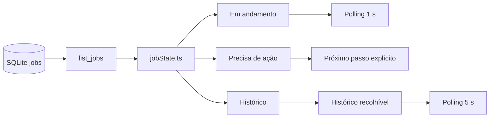
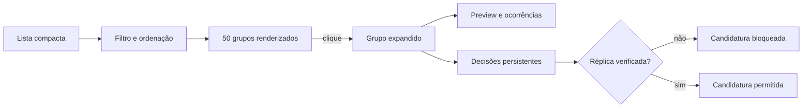

# Arquitetura operacional — Lumina 0.16

O backend continua sendo a autoridade sobre transições e persistência. O frontend centraliza apenas classificação, texto e cadência de atualização; não inventa estados nem promove jobs.

Previews de duplicatas deixam de ser custo inicial da página. As garantias de decisão permanecem no backend e independem da apresentação recolhida ou expandida.
