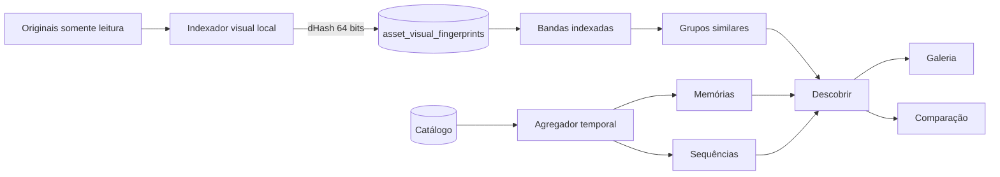
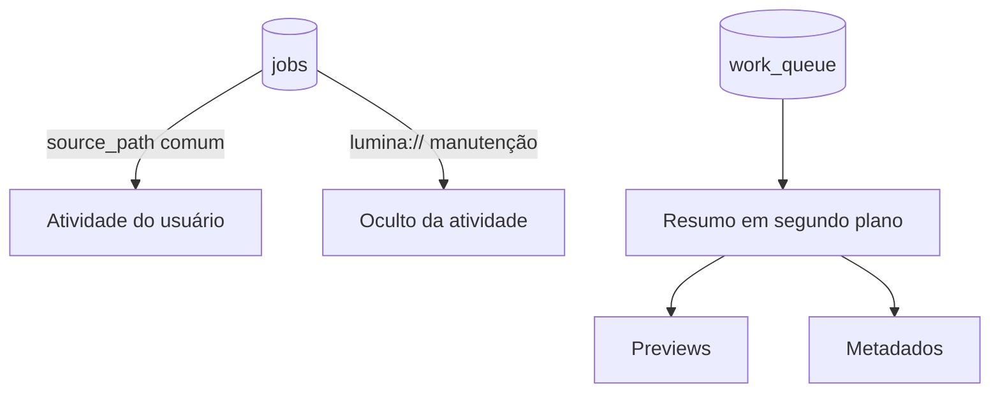

# Arquitetura 0.17 — descoberta e trabalho operacional

## Separação operacional

O banco continua sendo a fonte de verdade. A interface não infere execução pelo simples fato de existir um job técnico. O resumo de background deriva estados e contadores de `work_queue`; a tela de Atividade filtra explicitamente origens internas.

## Escala e segurança

- As quatro bandas de 16 bits reduzem o conjunto de pares candidatos antes do cálculo de distância de Hamming.
- O índice usa versão de algoritmo para permitir reconstrução futura.
- O caminho do original é apenas lido pelo decodificador; o resultado é gravado exclusivamente no SQLite do Lumina.
- A falha é isolada por mídia e contabilizada.
