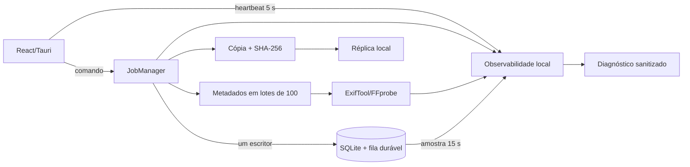

# Arquitetura — Lumina 0.18

## Fluxo operacional

## Decisões

1. **Memória limitada por construção:** enriquecimento não materializa metadados de todo o catálogo. Cada lote tem até 100 itens e é descartado após persistência.
2. **Escrita serializada:** importação, sincronização, metadados, verificação e proteção compartilham um único slot de escrita; solicitações posteriores ficam no SQLite e são despachadas na liberação.
3. **Leitura responsiva:** SQLite permanece em WAL, I/O interativo tem prioridade e checkpoints de metadados são passivos.
4. **Observabilidade fora do catálogo pessoal:** logs rotativos ficam em dados locais do aplicativo; a exportação combina somente agregados e linhas sanitizadas.
5. **Organização reversível:** pessoas, tags e álbuns são relações de catálogo com `ON DELETE CASCADE/SET NULL`; não há escrita de EXIF/IPTC nos originais.
6. **Geografia explicável:** agrupamento usa somente latitude/longitude persistidas e proximidade aproximada. Sem GPS significa sem resultado.

## Migração v15

- `people`, `asset_people` e `feature_settings` implementam identidades locais opt-in.
- `tags.parent_id` permite hierarquia sem quebrar tags e associações existentes.
- Índices cobrem busca por pessoa e árvore de tags.
- A migração é transacional e incrementa `user_version` para 15.

## Privacidade do diagnóstico

O exportador não inclui nomes da biblioteca, fontes, caminhos, nomes de arquivo, coordenadas ou hashes. Tokens semelhantes a credenciais e tokens com formato de caminho/mídia são substituídos. IDs de jobs aparecem apenas truncados nos logs operacionais.

