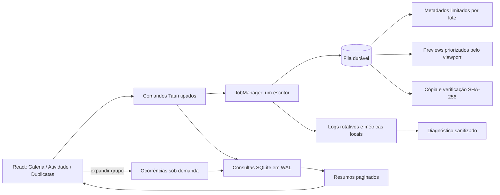

# Arquitetura — Lumina 0.19

## Fluxo de operação e curadoria

## Decisões preservadas

- React mantém estado de apresentação; regras de integridade ficam no domínio Rust/SQLite.
- SQLite WAL separa leituras interativas do escritor serializado.
- Filas persistidas são a fonte de verdade; animações ou estado React não determinam conclusão.
- Decisões de duplicatas são catálogo reversível. Não existe comando de exclusão física nesta versão.
- Ocorrências são carregadas somente após intenção do usuário; a lista usa contagem agregada.
- Operações em lote usam uma transação e repetem no backend a regra de réplica verificada.
- O heartbeat é um diagnóstico de ausência de atualização, não uma inferência de falha nem uma mutação do job.
- O painel de proteção lê métricas agregadas da fila e não interfere no executor.

## Limites contra regressão

- Metadados: lotes de até 100 registros e checkpoints passivos.
- Preview HD: uma geração bloqueante por vez, com resultado versionado em cache.
- Miniaturas: falhas permanentes não entram em ciclo automático de tentativas.
- Fontes: somente leitura; consolidação escreve apenas no acervo e na réplica configurados.
- Diagnóstico: exclui caminhos, nomes de mídia, hashes, GPS e credenciais.

O desenho visual do fluxo está em `docs/design/operation-curation-0.19.svg`.
