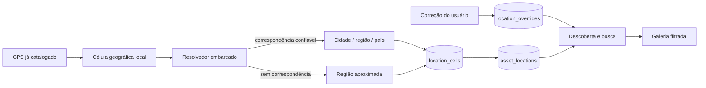

# Arquitetura — Lumina 0.20

## Fluxo de lugares

## Decisões

- A resolução é uma projeção derivada: `assets` continua sendo a fonte de verdade das coordenadas.
- Células de 0,05 grau reduzem cardinalidade e permitem cache idempotente sem alterar arquivos.
- A distância é calculada por Haversine e só gera nome automático dentro do limite de confiança; fora dele, o produto não inventa um lugar.
- `location_overrides` fica separado do cache automático, portanto reprocessamento e evolução do resolvedor não apagam a decisão humana.
- A busca usa `EXISTS` vinculada ao ativo, preservando paginação, filtros e o contrato de consultas parametrizadas.
- Não há cliente HTTP no fluxo; coordenadas não deixam o dispositivo.

## Compatibilidade e falhas

- A migração v16 é transacional e adiciona apenas tabelas e índice novos.
- Uma falha interrompe a transação inteira; o catálogo anterior permanece íntegro.
- A resolução pode ser retomada por nova execução, sem duplicação por suas chaves primárias e `UPSERT`.
- Exclusão de um ativo remove somente seu vínculo derivado por chave estrangeira; nomes compartilhados permanecem enquanto referenciados.

O desenho versionado está em `docs/design/places-0.20.svg`.
