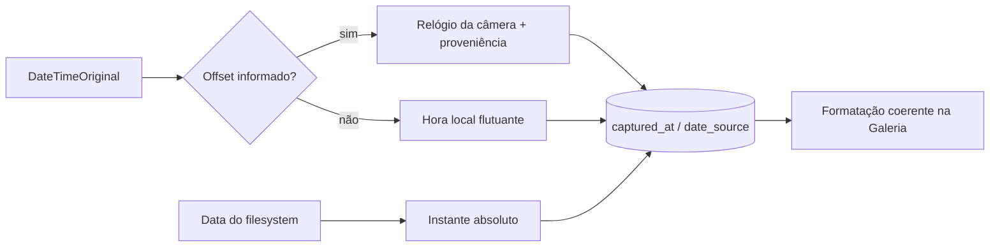
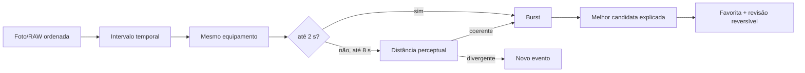

# Arquitetura — Lumina 0.21

## Tempo

Datas de câmera não recebem UTC inventado. A migração v17 é transacional e corrige apenas fontes históricas afetadas. Jobs e telemetria permanecem em UTC.

## Lugares

O resolvedor consulta em lote a base `Geolocation.dat` já embarcada no ExifTool. Se a mídia estiver indisponível ou não houver resposta, usa o gazetteer interno com limite de 45 km; fora desse limite mantém região aproximada. Cache automático e override manual continuam separados.

## Bursts

O algoritmo opera sobre fingerprints locais versionados. A interface apenas solicita decisões; persistência e integridade permanecem no backend/catalogo.

O desenho consolidado está em `docs/design/time-places-bursts-0.21.svg`.
