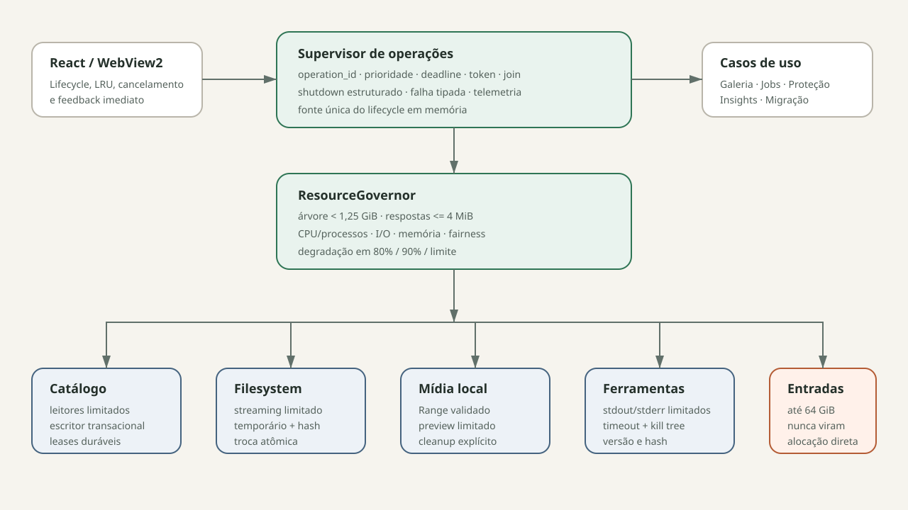

# Arquitetura-alvo — Lumina 0.22.2

## Direção

A evolução é incremental sobre o catálogo existente. Não haverá reescrita total. Regras de domínio ficam independentes de Tauri e detalhes de SQLite, filesystem, WebView e ferramentas são adaptadores limitados.



## Camadas

```text
UI por jornada
  -> comandos/DTOs versionados
Application: casos de uso + supervisor + ResourceGovernor
  -> ports
Domain: estados, invariantes, limites e decisões puras
  -> adapters
SQLite | filesystem | mídia/protocolos | processos | observabilidade
```

Dependências apontam para dentro. Domínio não importa Tauri, SQL, paths do SO nem componentes React.

## Componentes obrigatórios

### Operation supervisor

Registra toda operação longa com `operation_id`, dono, prioridade, deadline, cancelamento, estado e handle. Nenhum worker nasce fora dele. No fechamento, interrompe admissão, cancela, aguarda dentro do deadline e registra o que será retomado.

### ResourceGovernor

É a única autoridade de concorrência. Permits separados podem representar memória, leitura de disco, processo externo e trabalho pesado, mas são concedidos por uma política comum. Interação precede background e aquisição é cancelável.

### CatalogService

- migração uma vez no startup;
- leitores limitados e configurados;
- escritor serializado/transações explícitas;
- APIs por caso de uso, sem SQL na composição Tauri;
- revisão monotônica por domínio para invalidar caches;
- backup consistente e health checks fora do caminho crítico.

### DurableJobScheduler

O catálogo é a fonte de verdade. Cada execução reivindica lease com expiração e heartbeat. Transições validam estado anterior, versão e invariantes na mesma transação. Reinício recupera leases vencidos e nunca depende de token existente em memória.

### Bounded media/process adapters

- arquivo suportado <= 64 GiB;
- resposta de protocolo <= 4 MiB;
- preview com pixels/bytes limitados;
- stdout/stderr <= 8 MiB por canal;
- processo filho em árvore controlada;
- todos os readers fazem streaming e verificam cancelamento.

### Frontend lifecycle

Cada feature possui controller/hook com identidade da requisição. Foto, metadados e vídeo cancelam/coalescem no backend. Caches são LRU limitados. Virtualização cobre DOM e dados retidos. O estado persistente pertence ao catálogo; estado de navegação é efêmero e pequeno.

### Observability service

Recebe eventos estruturados por canal limitado e possui um único escritor. Métricas da árvore são amostradas com operação ativa e pressão. Export usa campos permitidos, não tenta limpar uma string arbitrária depois.

## Invariantes transversais

1. Entrada externa nunca controla alocação.
2. Nenhum estado de sucesso é emitido antes do commit verificável.
3. Nenhum erro crítico de persistência é descartado.
4. Nenhum job ativo existe sem lease válido.
5. Nenhum worker existe sem supervisor e shutdown.
6. Nenhum cache é ilimitado ou fonte de verdade.
7. Nenhum original é escrito.
8. Nenhuma proteção é declarada sem hash da réplica.

## Migração incremental sugerida

1. Cercar adaptadores atuais com limites e testes, sem mudar DTOs.
2. Introduzir supervisor/governor e migrar vídeo/processos primeiro.
3. Introduzir scheduler durável atrás dos comandos atuais.
4. Extrair CatalogService por jornada, começando por proteção/migração.
5. Migrar frontend para lifecycle cancelável e caches limitados.
6. Remover implementações antigas apenas após equivalência e endurance.

O ADR vinculante é `docs/adr/0001-bounded-resource-runtime.md`; requisitos e evidências estão em `NFR-0.22.2-RESILIENCE.md` e `TRACEABILITY-0.22.2.md`.
