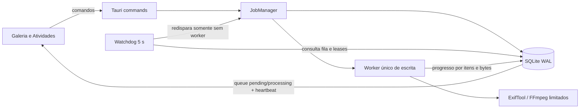

# Arquitetura 0.24

O catálogo é a fila durável e a fonte de verdade. O watchdog não mantém uma segunda fila em memória: quando não há worker ativo, recupera leases expirados e seleciona o próximo job persistido. `WorkerGuard` libera o slot inclusive após panic; a liberação e o watchdog oferecem recuperação complementar e idempotente.

Para RAW, o caminho conhecido é `ExifTool PreviewImage -> FFmpeg normalizador -> cache versionado`. Fotos decodificáveis continuam usando FFmpeg isolado. O cache é derivado e descartável.

A abertura no Explorer não depende mais de parsing de argumentos. Um PIDL absoluto é criado e entregue à Shell API, inclusive para espaços, vírgulas e caracteres Unicode.

Telemetria é persistida em UTC para ordenação. Exportações apresentam também o horário local e offset. Datas de captura continuam semanticamente separadas.
