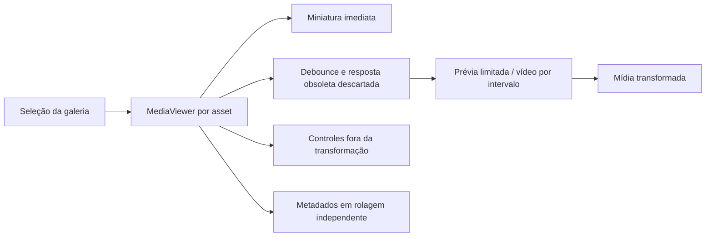
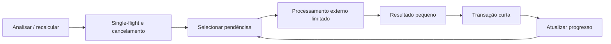

# Arquitetura e prevenção de regressões — 0.26

## Revisão focada nas jornadas deste pacote

| Problema identificado no código | Correção | Proteção contra regressão |
|---|---|---|
| Transformação e controles misturados no inspetor | `MediaViewer` isolado; mídia transformada, toolbar e reprodução externas | Teste real em Edge com foto/vídeo e três tamanhos de janela |
| Reflow/atualizações excessivas no gesto | Transformação agrupada com requestAnimationFrame e tamanho observado | Testes matemáticos e zoom visual medido por bounding boxes |
| Contador sem detalhamento correspondente | Predicado SQL único para resumo e paginação | Teste com 53 arquivos, dupla falha e múltiplas páginas |
| Análise visual decodificando originais no processo principal | Prévia 640px em subprocesso; decoder interno limitado a 1024px/16 MiB | Teste de índice real, incrementalidade e rejeição de dimensões excessivas |
| Transação envolvendo todo o processamento multimídia | Transação por resultado visual / lote geográfico | Cancelamento preserva commits anteriores; nenhum processo externo roda dentro da transação |
| Operações de descoberta concorrentes e sem status | Coordenador single-flight com token de cancelamento e progresso | Teste de exclusão, cancelamento e liberação do coordenador |
| Centenas de thumbnails solicitadas ao abrir Descobrir | Seções progressivas e IntersectionObserver | Teste de limite inicial e expansão |
| Nome inferido tratado como localização confirmada | Proveniência na UI e aproximação explícita | Testes de fallback, nomes manuais e campos nativos |
| Simulação de limpeza ignorando decisão humana | Predicado de elegibilidade incorpora decisões do grupo/ocorrência | Testes de precedência: manter/revisar bloqueiam candidatura |
| Vite observando DLLs durante compilação Rust | Watch exclui src-tauri e artifacts | Build e smoke de navegador durante compilação nativa |

## Fluxos

## Contratos e limites

- Falhas: consulta paginada consistente dentro de uma transação de leitura; contador do card é um snapshot independente e pode mudar enquanto um job trabalha. Atualizar lista obtém um novo snapshot.
- Cancelamento: subprocessos recebem token; não interromper transação entre dois writes relacionados. O lote em curso termina ou é descartado antes de parar. Índice já confirmado é reutilizado na execução seguinte. Recalcular lugares revisita os arquivos explicitamente; não é uma fila durável.
- Cache de descobertas: até duas bibliotecas, TTL de 30 segundos e botão Atualizar. Resultados são invalidados pela nova análise/renomeação; não há cache global sem identificação da biblioteca.
- Smoke desktop utiliza `LUMINA_DATA_DIR` absoluto para configuração/diagnósticos e `WEBVIEW2_USER_DATA_FOLDER` separado. Sem essas variáveis, os caminhos históricos permanecem iguais. Não confiar apenas em mudar `LOCALAPPDATA`: no Windows, APIs de pastas conhecidas podem ignorar essa variável. O override relativo é recusado para impedir abertura acidental do perfil padrão.
- Limites globais existentes de processos, arquivos de 64 GiB, respostas de protocolo e previews continuam valendo. Esta revisão não substitui o documento de NFRs existente.
- A qualidade visual passa a ser estimada em prévias pequenas; não é uma medição profissional de foco do original. A versão do algoritmo evita misturar índices antigos com novos.
- Descobrir ainda lê o inventário para montar agrupamentos; a redução de renderização não equivale a paginação SQL de todo o catálogo. Escalas maiores exigem medição e eventual materialização incremental, sem prometer custo constante.
- Nomes manuais têm prioridade. Nomes embutidos representam o que está no arquivo; coordenadas precisas não garantem a existência de endereço embutido. A base offline não prova endereço, município administrativo ou ponto turístico.
- O campo `GeolocationDistance` é distância em quilômetros até a localidade devolvida, não a precisão do GPS. Referência primária: [ExifTool Geolocation](https://exiftool.org/geolocation.html).

## Gate de entrega

Não declarar homologação do dispositivo do usuário a partir dos testes locais. Publicar candidata somente após build, testes de frontend/backend e smoke do executável. Preservar tags anteriores, logs históricos e resultados de testes. Mudanças futuras devem repetir setup, importação, proteção, Explorer, galeria e descoberta, além do cenário novo.

Automação reproduzível Windows:

- `powershell -ExecutionPolicy Bypass -File scripts/verify-0.26.ps1` executa frontend, build, formatação, lint e backend com diagnósticos isolados. `-SkipDebugResourceCopy` é um workaround restrito ao debug quando a recópia de recursos é bloqueada pelo ambiente.
- Com `npm.cmd run dev` ativo, `npm.cmd run test:browser` verifica layout e mídia sintética no Edge instalado.
- `node scripts/smoke-desktop.mjs <executável-extraído-do-instalador>` verifica o aplicativo real em perfil e biblioteca descartáveis, sem sobrescrever a configuração normal. Os artefatos de teste ficam em `artifacts/0.26` (fora do Git).
