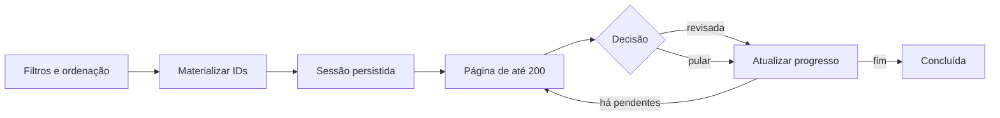
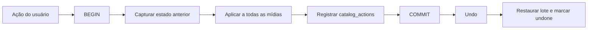

# Arquitetura — 0.27

## Decisões

| Área | Decisão | Proteção |
|---|---|---|
| Curadoria longa | Materializar até 50 mil IDs ordenados em `curation_session_items`; servir janelas de 200 | Criação fora da thread de UI, transação única e retomada sem recalcular a consulta |
| Ações em lote | Registrar snapshot anterior em `catalog_actions` e desfazer todo o lote em uma transação | Estados parciais não são apresentados como undo concluído |
| Comparação | Receber 2–4 IDs explícitos; carregar previews limitados; não abrir original fotográfico no WebView | Backpressure de preview existente e decisão sem remoção |
| Descobrir | Persistir `discovery_snapshots`; triggers invalidam qualquer resultado afetado | `data_version` impede publicar snapshot calculado sobre catálogo alterado concorrentemente |
| Bursts | Persistir somente exclusões do agrupamento sugerido | Associação corrigida no catálogo, origem imutável e grupo com no mínimo duas mídias |
| Lugar manual | Override por asset antes do override por célula e do nome estimado | Escopo selecionado visível e undo transacional |
| Falha técnica | Mesmo predicado base para contador/lista; filtros adicionais vinculados; retry apenas transitório | Formato permanente não entra em ciclo automático |

## Fluxo de curadoria

## Fluxo de ação reversível

## Migração v21

Tabelas novas: `curation_sessions`, `curation_session_items`, `discovery_group_exclusions`, `asset_location_overrides` e `discovery_snapshots`. Índices cobrem retomada da fila e última ação aplicada. Triggers invalidam o snapshot de Descobrir quando o catálogo que o alimenta muda. Não há `DROP`, reescrita de assets nem alteração de caminhos físicos.

O desenho de componentes está em [docs/design/curation-0.27.svg](docs/design/curation-0.27.svg).

## Limites

- Uma sessão aceita até 50 mil mídias e entrega 200 por vez; filtros explícitos da galeria aceitam até 5 mil IDs.
- Ações interativas continuam limitadas a 5 mil IDs; nomear lugar usa no máximo 500.
- A comparação é limitada a quatro mídias e previews fotográficos limitados. Não é ferramenta de inspeção de pixel do original.
- Corrigir um burst altera a interpretação do agrupamento, nunca EXIF, nome, pasta ou bytes.
- O cache de Descobrir é derivado. Pode ser descartado sem perda e nunca é fonte de verdade.

## Antipadrões evitados

- Sem duplicação de regra física: a 0.27 não implementa cópia, hash ou proteção paralela.
- Sem estado de curadoria apenas no React/localStorage: fila e decisões vivem no SQLite.
- Sem N+1 para materializar a sessão: um SELECT de IDs e statement preparado de inserção.
- Sem undo item a item depois de um comando em lote.
- Sem retry indiscriminado de erro permanente.
- Sem atualização de EXIF para corrigir nome de lugar.
