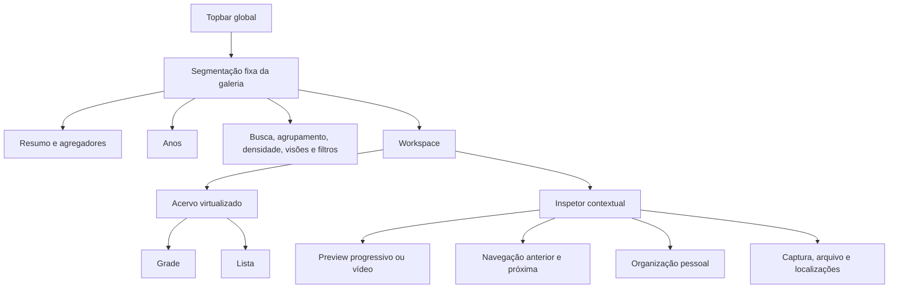
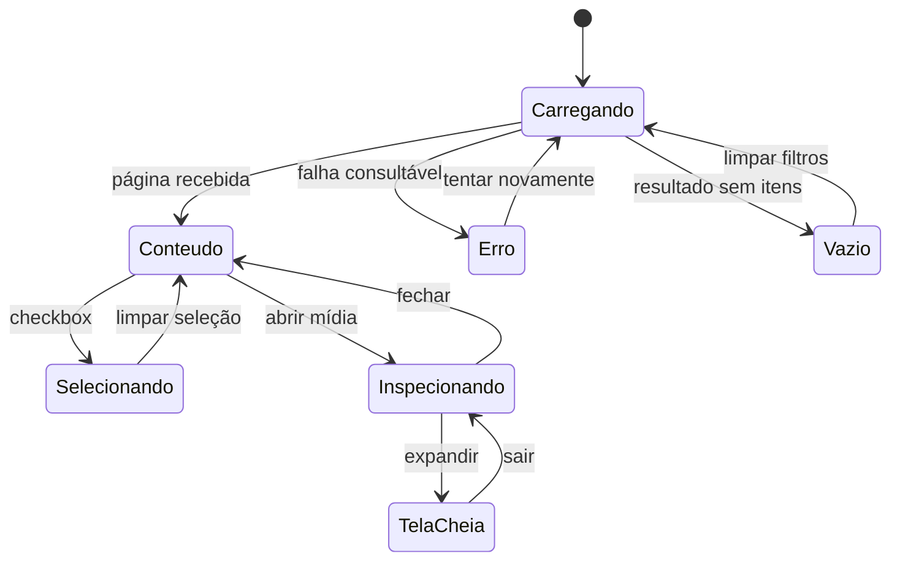

# Baseline visual — Galeria Lumina 0.15

Status: candidata consolidada `0.15.0-beta.2`. Esta baseline registra a intenção visual implementada e os critérios usados para homologação e regressão.

## Princípio

A galeria é um workspace contínuo, não uma página seguida por um painel sobreposto. Segmentação, acervo e inspeção coexistem; abrir uma mídia reduz a área do acervo de maneira previsível, sem escondê-lo.

## Anatomia

Referências visuais:

- [Workspace amplo](docs/design/gallery-workspace-wide.svg)
- [Adaptação compacta](docs/design/gallery-workspace-narrow.svg)
- [Estados da galeria](docs/design/gallery-states.svg)

## Layout amplo

Acima de 1280 px, o workspace usa duas regiões quando existe uma mídia aberta:

- Acervo flexível com mínimo operacional de 620 px.
- Inspetor de 390 px, sticky e com rolagem própria.
- Intervalo de 18 px entre as regiões.
- Segmentação sticky abaixo da topbar, com fundo translúcido e separação discreta.

Sem mídia aberta, o acervo ocupa toda a largura. Tela cheia continua sendo uma modalidade explícita do visualizador.

## Layout intermediário e compacto

- Entre 1050 e 1280 px, o inspetor reduz para 350 px e as colunas da lista ficam mais densas.
- Abaixo de 1050 px, o acervo volta a ocupar uma coluna e o inspetor vira uma superfície flutuante delimitada.
- Colunas secundárias da lista são removidas progressivamente; identidade, captura e arquivo permanecem prioritários.
- Nenhuma ação pode depender apenas de hover.

## Grade

- Tamanhos: compacta, confortável e ampla.
- Miniatura domina a hierarquia; nome e câmera formam o segundo nível.
- Favorito, revisão, avaliação, duplicidade e falha de proteção usam marcadores pequenos e consistentes.
- Seleção usa contorno verde e checkbox independente da abertura da mídia.
- O carregamento de miniatura nunca bloqueia busca, filtros ou abertura de outros itens.

## Lista

Colunas estáveis:

| Coluna | Conteúdo primário | Conteúdo secundário |
|---|---|---|
| Mídia | miniatura e nome | câmera/dispositivo |
| Captura | data e hora | alerta de data suspeita |
| Arquivo | extensão | tamanho e dimensões |
| Origem | origem principal | número de origens ou tipo |
| Proteção | protegida, pendente ou atenção | indicador cromático |

Favorito, revisão e avaliação ficam em uma região final compacta. Nomes extensos usam elipse sem deslocar as demais colunas.

## Segmentação fixa

A região fixa reúne três níveis:

1. Quantidade, volume, tipo de mídia, favoritos, proteção e indicadores do resultado.
2. Segmentação temporal por ano.
3. Busca, agrupamento, densidade, visões salvas, modo grade/lista e filtros avançados.

Critérios:

- Deve permanecer disponível durante rolagem longa.
- Não pode mudar filtros implicitamente ao alternar grade/lista.
- Contagens e resultado devem representar o mesmo conjunto.
- O estado ativo precisa ser reconhecível sem depender exclusivamente de cor.

## Inspetor

- Faz parte do workspace em telas amplas e mantém o acervo acionável.
- Preview imediato é substituído pelo derivado HD quando estiver pronto.
- Foto, vídeo e metadados devem mudar juntos durante a navegação.
- A navegação anterior/próxima permanece junto ao preview; a antiga faixa rolável de miniaturas foi removida para reduzir ruído e rolagem interna.
- A seleção usa preenchimento, contorno, checkbox e a identificação textual “Selecionado”, mantendo o estado reconhecível sem depender apenas de cor.
- Captura omite a origem técnica da data; Arquivo e mídia omite MIME, perfil de cor e orientação por não apoiarem as decisões principais desta interface.
- Organização pessoal, captura, arquivo e localizações seguem ordem do mais frequente ao técnico.
- Fechar o inspetor devolve toda a largura ao acervo sem perder filtros ou posição.

## Estados

Estados obrigatórios:

- Carregamento inicial e paginação incremental.
- Conteúdo em grade e lista.
- Resultado vazio com saída acionável.
- Erro com tentativa novamente.
- Seleção simples e em lote.
- Inspetor aberto, fechado e em tela cheia.
- Preview imediato, HD preparando, HD disponível e indisponível.
- Proteção saudável, pendente e com erro.

## Linguagem visual

- Superfície principal: `--paper` sobre fundo `#f5f3ed`.
- Texto: `--ink`; texto secundário: `--muted`.
- Ação/estado positivo: `--green`; atenção: âmbar; erro: `--red`.
- Cantos: 10–18 px conforme hierarquia da superfície.
- Pills representam atributo ou estado curto; não substituem mensagens de erro.
- Foco visível mínimo de 3 px.
- Hover acrescenta elevação e contraste discretos, sem mover conteúdo mais de 1 px.

## Critérios de aceite visual

- A galeria continua reconhecível e utilizável com o inspetor aberto.
- Não há sobreposição entre segmentação, seleção em lote e conteúdo.
- Grade e lista apresentam a mesma coleção e os mesmos estados pessoais.
- Texto essencial permanece legível em 100%, 125% e 150% de escala do Windows.
- Teclado alcança controles na ordem visual e sempre mostra foco.
- Estados vazio, erro e carregamento não causam salto estrutural imprevisível.
- A responsividade reduz informação secundária antes de esconder ações.
- Capturas aprovadas passam a ser evidência da baseline para regressões futuras.

## Extensões consolidadas na beta.2

Ordenação persistente, densidade própria da lista, seleção por intervalo, seções recolhíveis de metadados e comparação lado a lado estendem esta anatomia sem recriar sidebar sobreposta ou duplicar controles. A comparação é uma superfície modal focada; ao fechar, o workspace retorna com filtros e seleção preservados.

## Refinamento da visão geral

- Memórias são o indicador principal e primeira/última captura são apresentadas separadamente para fotos e vídeos.
- Capacidade, proteção, acervo principal e réplica local formam uma única superfície; “tamanho médio de arquivo” substitui a referência interna ao p90.
- Composição compara somente fotos e vídeos em gráfico de proporção.
- Formatos, equipamentos normalizados e codecs têm grupos visuais distintos no inventário técnico.
- Insights usam cards acionáveis e desempenho compara visualmente até cinco processamentos, discriminando análise, leitura, cópia e previews.
